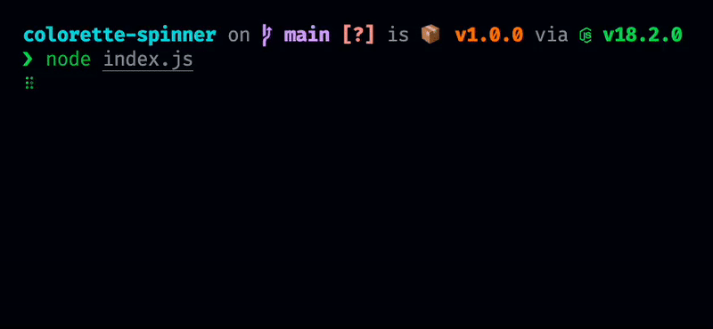

<div align="center">

# colorette-spinner

**A super tiny and efficient terminal spinner based on [nanospinner]**

[](https://github.com/favware/colorette-spinner/blob/main/LICENSE)
[](https://www.npmjs.com/package/@favware/colorette-spinner)

[](https://join.favware.tech)



</div>

## Description

This is an extremely tiny and simple terminal spinner based on [nanospinner]
while using [colorette] instead of picocolors

## Installation

You can use the following command to install this package, or replace
`npm install -D` with your package manager of choice.

```sh
npm install -D @favware/colorette-spinner
```

## Usage

<details>
  <summary>
    <b>
      <code>
        .spin()
      </code>
    </b>
  </summary>

Looping over `spin` method will animate a given spinner.

```js
setInterval(() => {
  spinner.spin();
}, 25);
```

</details>

<details>
  <summary>
    <b>
      <code>
        .start(options?)
      </code>
    </b>
  </summary>

In order to start the spinner call `start`. This will perform drawing the
spinning animation

```js
spinner.start();
spinner.start({ text: 'Start', color: 'yellow' });
```

</details>

<details>
  <summary>
    <b>
      <code>
        .stop(options?)
      </code>
    </b>
  </summary>

In order to stop the spinner call `stop`. This will finish drawing the spinning
animation and return to new line.

```js
spinner.stop();
spinner.stop({ text: 'Done!', mark: ':O', color: 'magenta' });
```

</details>

<details>
  <summary>
    <b>
      <code>
        .success(options?)
      </code>
    </b>
  </summary>

Use `success` call to stop the spinning animation and replace the spinning
symbol with check mark character to indicate successful completion.

```js
spinner.success();
spinner.success({ text: 'Successful!', mark: ':)' });
```

</details>

<details>
  <summary>
    <b>
      <code>
        .warn(options?)
      </code>
    </b>
  </summary>

Use `warn` call to stop the spinning animation and replace the spinning symbol
with warn mark character to indicate warning completion.

```js
spinner.warn();
spinner.warn({ text: 'Warning!', mark: ':|' });
```

</details>

<details>
  <summary>
    <b>
      <code>
        .error(options?)
      </code>
    </b>
  </summary>

Use `error` call to stop the spinning animation and replace the spinning symbol
with cross character to indicate error completion.

```js
spinner.error();
spinner.error({ text: 'Error!', mark: ':(' });
```

</details>

<details>
  <summary>
    <b>
      <code>
        .update(options?)
      </code>
    </b>
  </summary>

Use `update` call to dynamically change

```js
spinner.update({
  text: 'Run test',
  color: 'white',
  stream: process.stdout,
  frames: ['.', 'o', '0', '@', '*'],
  interval: 100
});
```

</details>

<details>
  <summary>
    <b>
      <code>
        .clear()
      </code>
    </b>
  </summary>

Clears the spinner`s output

```js
spinner.clear();
```

</details>

<details>
  <summary>
    <b>
      <code>
        .reset()
      </code>
    </b>
  </summary>

In order to reset the spinner to its initial frame do:

```js
spinner.reset();
```

</details>

## Buy us some doughnuts

Favware projects are and always will be open source, even if we don't get
donations. That being said, we know there are amazing people who may still want
to donate just to show their appreciation. Thank you very much in advance!

We accept donations through Ko-fi, Paypal, Patreon, GitHub Sponsorships, and
various cryptocurrencies. You can use the buttons below to donate through your
method of choice.

|   Donate With   |                      Address                      |
| :-------------: | :-----------------------------------------------: |
|      Ko-fi      |  [Click Here](https://donate.favware.tech/kofi)   |
|     Patreon     | [Click Here](https://donate.favware.tech/patreon) |
|     PayPal      | [Click Here](https://donate.favware.tech/paypal)  |
| GitHub Sponsors |  [Click Here](https://github.com/sponsors/Favna)  |
|     Bitcoin     |       `1E643TNif2MTh75rugepmXuq35Tck4TnE5`        |
|    Ethereum     |   `0xF653F666903cd8739030D2721bF01095896F5D6E`    |
|    LiteCoin     |       `LZHvBkaJqKJRa8N7Dyu41Jd1PDBAofCik6`        |

## Contributors

Please make sure to read the [Contributing Guide][contributing] before making a
pull request.

Thank you to all the people who already contributed to Sapphire!

<a href="https://github.com/favware/colorette-spinner/graphs/contributors">
  
</a>

[contributing]: ./.github/CONTRIBUTING.md
[nanospinner]: https://github.com/usmanyunusov/nanospinner
